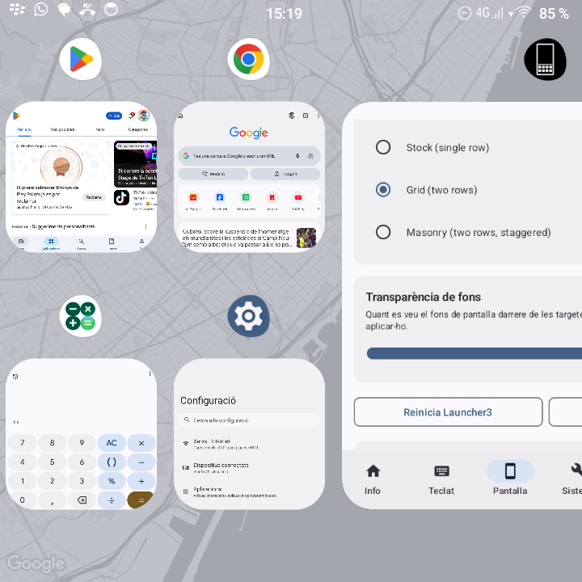
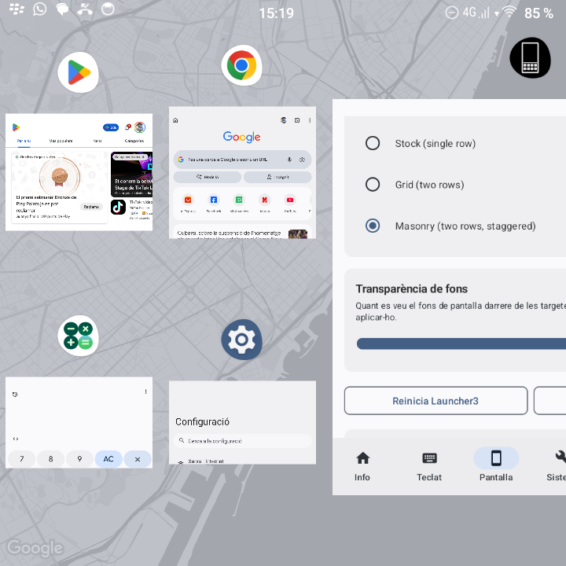

# Q25 Toolbox

A root app for the Zinwa Q25 (KernelSU, MediaTek-based, physical QWERTY
keyboard) that bundles a set of tweaks into one UI, organised into six
bottom-bar sections:

- **Info** — device status landing page: build info and battery (level,
  health, temperature, voltage, capacity), plus an entry into the Battery
  Usage breakdown.
- **Keyboard** — key remapping, lockscreen PIN entry on the physical
  keyboard, per-app keyboard block, chat Enter-to-send, calculator-key
  routing, IME suggestion shortcuts, and in-call shortcuts.
- **Screen** — extra dimming, per-app display scaling, and Recents UI Layout:
  an LSPosed module (v3.0+) forcing the real two-row Grid Recents overview,
  with a Masonry (staggered-tile) variant, an adjustable background
  transparency slider, and an APK-level Recents Provider Repair for the BenOS
  OTA that breaks Overview.
- **System** — BesLoudness speaker enhancement (with an optional night
  schedule), auto-focus input, Ticker Notifications, and Proximity Sensor
  Workarounds (auto-recovering the screen/keyboard after a stuck-near sensor
  post-call, plus a live sensor/Lux monitor and the OEM factory test screen
  merged into the same module).
- **Network** — telemetry blocking, wireless ADB, and Bluetooth/Location
  auto-disable.
- **Settings** — update checking (with in-app download + install), quick
  links to the Accessibility/Input Method system settings, a SystemUI restart
  action, and a Notification Access shortcut, plus contributors and about.

Ported from [Key2 Toolbox](../Key2Toolbox), the same app built for the
BlackBerry Key2. Most of the UI and architecture carried over unchanged; the
hardware underneath several modules did not, so a few Key2-only features
(ZRAM control, the Key2 App Spoof module) were left out of this Q25 build.

## Version compatibility

| App version | Use it if | Recents grid |
| --- | --- | --- |
| **v3.0+** | any stock-based Q25 ROM, with an Xposed framework (LSPosed / Vector) available | LSPosed hook, survives OTAs |
| **2.1.1** | BenOS beta3, no Xposed framework | bundled patched-launcher bind-mount |
| **2.0.5** | BenOS pre-beta3a / older stock | older patched-launcher |

From v3.0 the Grid/Masonry Recents overview is an LSPosed module. Every other
module works without a framework, and Recents falls back to stock. If you had
the bind-mounted grid from 2.x, v3.0 removes it on first launch.

## Architecture

The UI follows Material You (Monet), in light or dark to match the system.
Most modules are stateless: they fire root commands on demand and persist by
installing a script to `/data/adb/service.d/`. PIN keyboard, the input fixes,
Per-App Keyboard Block, Per-App Display Scaling, Auto-Focus, and In-Call
Shortcuts instead depend on a long-lived `Q25AccessibilityService` that
watches window/IME/foreground state and intercepts physical key events, since
none of that is observable from a one-shot root command. Their settings live
in a `q25tweaks` SharedPreferences file rather than going through
`AssetInstaller`.

The accessibility-service modules only work once **Q25 Toolbox** is enabled
under Settings → Accessibility - each of their screens shows a banner with a
direct link there if it isn't. Reinstalling the app resets this, so it needs
re-enabling after every fresh install.

The boot-time daemons (Extra Dim's schedule, BesLoudness's schedule, Global
Telemetry Block, Bluetooth Auto-Disable, Location Auto-Disable) run detached
(`setsid`) and are guarded by a PID lock that also verifies
`/proc/$PID/cmdline` still names the same script - not just `kill -0`, which
can false-positive once an unrelated process reuses a stale PID after
reboot. A dead daemon isn't the only failure mode, though: one left running
whatever an older app version installed looks identical to a healthy one
from the outside (it holds its lock and loops forever either way), so
`DaemonMaintenance.sweep()` runs once per app launch (from the home screen,
before any tab is picked) and compares each installed script's actual
content against what today's app
would install, reinstalling anything stale - not just anything dead. It also
removes daemons left behind by features that are now hidden or removed (see
DT2W below). Each module's own screen does the same narrower check on open.

## Signing with your existing keystore

`app/build.gradle.kts` has a commented-out `signingConfigs { create("release") {...} }`
block referencing `kgr_signing.keystore` / alias `kgr`. Uncomment it, point
`storeFile` at your keystore path, and wire `signingConfig = signingConfigs.getByName("release")`
into the `release` build type. Consider passing the password via
`gradle.properties` (gitignored) or an env var rather than committing it in
the build script. Until then, both build types are signed with the debug key.

## How each module works

### Key Remapper (`KeyRemapController`)
- Remaps one of three source keys to Right Ctrl at the hardware keylayout
  level: the **Currency key** (`GRAVE`, scancode 41 - the firmware-miswired
  key next to Space), **Right Shift** (scancode 54), or the **Recents**
  BlackBerry key (`APP_SWITCH`, scancode 580 - remapping it means losing the
  hardware shortcut for recents).
- Rewrites `/system/usr/keylayout/Q25_keyboard.kl` (confirmed live via
  `dumpsys input` that the keyboard actually resolves its KeyLayoutFile to
  this exact path - not `Generic.kl`, despite the two files historically
  sharing near-identical content). A generated boot script
  (`service.d/key_remap.sh`) unbinds the i2c driver first (so EventHub
  releases its file descriptor on the layout file), `umount`s any previous
  bind, copies the pristine original, `sed`s the target scancode's keycode to
  `CTRL_RIGHT`, `chcon`s it to `system_file` so `system_server` can read it,
  bind-mounts the copy over the original, and rebinds the driver
  (`/sys/bus/i2c/drivers/Q25_keyboard/{un,}bind`, device `6-001f`) so
  EventHub reloads it. The same script runs live on save, so no reboot is
  needed.
- Settings live in the shared `q25tweaks` prefs file.

### Auto-Focus Input (`AutoFocusController`)
- Uses the accessibility service to focus the first editable field in
  selected apps once a printable key is pressed, so e.g. the Google Phone
  dialer or a browser's search box is ready for immediate keyboard input
  without tapping it first.
- Focuses via `ACTION_FOCUS`/`ACTION_CLICK` then inserts the triggering
  character via `ACTION_SET_TEXT` once the field actually receives input
  focus - woken by the next relevant accessibility event rather than a fixed
  poll interval, with a 1s timeout as a safety net for apps where that event
  never cleanly fires.
- Each insertion is followed by `ACTION_SET_SELECTION` to the end of the text.
  Without it the IME still believes the caret is at offset 0 on an empty
  field, and inserts the *next* typed letter at the front, auto-capitalized.
- Keys pressed while an insertion is in flight are claimed and appended to
  that same insertion in press order, rather than being left to the IME and
  then overwritten by an `ACTION_SET_TEXT` snapshot taken before them.
- A negative "this window has no editable field" result is cached briefly, so
  typing into a screen with nothing to focus doesn't re-walk the entire node
  tree, on the main thread, once per letter.
- The per-app target list is stored in the same `q25tweaks` prefs set used by
  the other accessibility-service modules, so the behavior can be enabled or
  disabled independently for each app.

### In-Call Shortcuts (`Q25AccessibilityService`)
- Adds physical-keyboard shortcuts on Google Phone's in-call screen: **M**
  toggles mute, the **currency key** (its raw `GRAVE` keycode, or
  `CTRL_RIGHT` if remapped above) toggles speaker, and `W E R S D F Z X C 0`
  route to the dialpad as `1 2 3 4 5 6 7 8 9 0` - inserted via
  `ACTION_SET_TEXT` directly into the digits field rather than shell-injected
  `input keyevent`, which is unreliable immediately after the dialpad's
  own open/visibility transition. The dialpad also auto-opens when the call
  screen loads.
- Runs with priority ahead of Auto-Focus's own key handling on the in-call
  screen specifically (identified by the presence of the expected
  keypad/mute/speaker toggle triple), so a call in progress can't have its
  mute/speaker presses stolen by Auto-Focus reaching for an unrelated
  unfocused field elsewhere in the same window tree. Auto-Focus still handles
  every other dialer screen (pre-call dial pad, contact search) normally.

### Proximity Sensor Workarounds (`Q25AccessibilityService` + `KeyRemapController` + `ProximitySensorController`)
- This device's proximity sensor has, in practice, been observed getting
  stuck near/covered after a call ends, leaving the screen dark - and
  separately, taking the physical keyboard's i2c driver down with it, not
  just the display.
- **Auto-recover after calls** (default on): confirms a call has genuinely
  ended (not just backgrounded mid-call, which looks identical from the
  window-state event alone) against `dumpsys telecom`'s actual call state,
  then if the screen is still off 5 seconds later, forces it back on with
  `input keyevent KEYCODE_WAKEUP`. A no-op if the screen already came back on
  by itself.
- **Respawn keyboard now** (manual button): unbinds and rebinds the
  `Q25_keyboard` i2c driver (`KeyRemapController.respawnKeyboard()`) to
  recover a stuck physical keyboard. Deliberately **not** run automatically
  alongside the screen wake above - pairing an i2c unbind/rebind (which
  re-registers the keyboard driver's display notifier) with a forced wake
  (its own display transition) right next to it was found to race the
  display driver and crash the kernel
  (`bbqX0kbd_disp_notifier_callback` null deref), including on every mid-call
  app switch before the `dumpsys telecom` check existed, not just real
  hangups. Any active Key Remap survives an unbind/rebind unaffected - the
  bind mount is a VFS construct independent of the driver being bound.
- **Live Sensor Monitor**: shows the proximity sensor's binary near/far state
  plus a continuous analog Lux reading from the co-located `hx32062se_als`
  light sensor, so you can watch it react in real time.
- **Factory Hardware Test Mode** (button): launches `com.hodafone.factorytest`'s
  `P_SensorTestActivity` (chosen over `PsensorTestActivity`/`PsensorProxTestActivity`
  to dodge an OEM firmware bug). This is a raw sensor readout screen only -
  confirmed via decompiled OEM smali that no calibration write path exists;
  the near/far threshold is fixed in the sensor's firmware.

### Extra Dimming (`ExtraDimController`)
- Toggles Android's built-in Accessibility "Extra Dim" feature
  (`reduce_bright_colors_activated` / `reduce_bright_colors_level` secure
  settings) directly from the toolbox, with a 0-100% intensity slider.
- The manual toggle/level need no persistence - they're standard system
  settings that survive reboot on their own.
- **Auto Night Dim schedule** (optional): a `service.d/extra_dim_schedule.sh`
  watchdog turns Extra Dim on/off at a chosen start/end time, accurate to the
  minute (window may wrap past midnight). It only writes the setting on an
  on/off transition, so a manual override in between the two edges isn't
  immediately clobbered - matching how Android's own Night Light schedule
  coexists with manual toggles.

### BesLoudness (`BesLoudnessController`)
- Toggles the vendor speaker loudness-enhancement DSP stage, the same one
  behind the stock Settings app's own "Sound Enhancement" screen - confirmed
  live on-device by watching `logcat` while using that screen: it calls
  `AudioManager.setParameters("SetBesLoudnessStatus=0/1")`, which the HAL
  applies immediately (no restart) to the `mtk_bessound` DSP library and
  persists into `/vendor/etc/audio_param/SoundEnhancement_AudioParam.xml`.
- The obvious-looking alternative,
  `persist.vendor.audiohal.besloudness_state`, is a red herring: writing it
  does nothing audible, since it isn't the value the HAL actually reads live.
- The manual toggle calls `AudioManager` directly from the app process. The
  optional schedule (mirrors Extra Dim's: start/end time, on/off-transition
  only) is a `service.d/besloudness_schedule.sh` watchdog - but that's a
  plain shell script and can't call `AudioManager` itself, so it hands off to
  the app via an explicit `am broadcast` to `BesLoudnessReceiver`, which a
  root shell can deliver to a non-exported receiver even though third-party
  apps can't.

### Per-App Display Scaling (`AppScalingController` + `Q25AccessibilityService`)
- This ROM ignores every *per-app* scaling mechanism - the compat-framework
  `DOWNSCALE_*` changes and GameManager downscale are both no-ops, and `wm
  density` has no effect either (all verified on-device, byte-identical
  screenshots). The one display knob that works is `wm size` (physical
  resolution).
- So "per-app scaling" is done by switching the **global** resolution: the
  accessibility service (which already tracks the foreground app for the
  keyboard-block module) runs `wm size <W>x<H>` when a chosen app comes to
  the foreground and `wm size reset` when leaving.
- Targets are full width×height (not just squares), so an app can be given a
  taller portrait aspect. Presets follow duc1607's
  [q25-res-changer](../q25-res-changer) (720×720 native, 720×772, 720×960,
  720×1280, 720×1440; the SystemUI-breaking 780×780 is omitted), plus a
  **Custom…** entry to type any W×H (240–2000).
- The whole screen (incl. system UI) briefly relayouts on enter/exit -
  inherent to a global resolution change. Per-app targets are stored as a
  `pkg=WxH` StringSet in the `q25tweaks` prefs; the service always resets to
  native on teardown so it can't leave the screen stuck at a scaled
  resolution.
- Investigated (and rejected) a per-app compat-framework alternative for
  this: `am compat enable OVERRIDE_MIN_ASPECT_RATIO_LARGE <pkg>` is accepted
  without error on this ROM, but `dumpsys window` confirms it has zero actual
  effect on the app's reported window bounds - the `wm size` swap remains the
  only thing that works. Also: this technique (and the binary-patch approach
  used by Recents UI Layout below) isn't worth pursuing for regular Play
  Store apps like Calendar/Substack/Phone-dialer - unlike a stable
  `/system_ext` priv-app, they live under a per-install `/data/app/~~random~~`
  path that changes on every update, Play Store silently overwrites any
  patched binary on the next auto-update, and a re-signed APK risks tripping
  each app's own Play Integrity/anti-tampering checks (account sync,
  subscription login).

### Recents UI Layout (`RecentsTweaksController` + `xposed/RecentsHookInit`)

| Grid | Masonry |
| --- | --- |
|  |  |

As of v3.0 this is an **LSPosed module**, not a binary patch. It needs an
Xposed framework (LSPosed / Vector on KernelSU / APatch / Magisk); without
one, Recents stays stock and nothing else is affected. The Recents screen
shows whether the module is active and how to scope it.

- Forces the real two-row Grid Recents overview (multiple task cards
  on-screen, not one-app-per-swipe) on `SearchLauncherQuickStep.apk`, the
  AOSP/QuickStep launcher that provides gesture-nav Recents on this device
  regardless of which app is set as default Home.
- `RecentsHookInit` (scoped to `com.android.launcher3`) hooks whatever
  launcher build is actually running, by method name, in memory. Verified
  against the decompiled BenOS launcher:
  - `DisplayController.Info.isTablet(WindowBounds)` -> true while a grid mode
    is active. The `DeviceProfile` constructor derives `isTablet` from it
    before computing any Overview geometry, and that geometry (task sizing,
    the grid maths, ~15 read sites in `RecentsView`) branches on the
    `isTablet` field, not on `RecentsView.showAsGrid()`. `showAsGrid()` is
    pinned too, mainly for a deterministic off state.
  - `DeviceProfile.recalculateHotseatWidthAndBorderSpace()` is no-oped while a
    grid mode is active: forcing a phone to tablet makes it run (it is
    skipped on a non-scalable-grid phone) and divide by
    `numShownHotseatIcons - 1` (= 0). The launcher's own hotseat is never
    shown here (third-party Home), so this is safe.
  - `overview_grid_row_spacing`, `overview_grid_side_margin` and
    `task_thumbnail_icon_drawable_size_grid` are backfilled on the
    `DeviceProfile` when they resolve to `0` from the phone resource bucket -
    without this the grid lays out with 0-size task icons and no row gap.
  - `isTaskbarPresent` is cleared after `DeviceProfile` construction so the
    forced-tablet profile does not bring the floating taskbar.
- Because it is a runtime hook and not a mounted file, it survives BenOS OTAs
  on the same Android major with no per-OTA maintenance, and it cannot leave
  the device with no Overview provider - its failure mode is "grid silently
  falls back to stock". This replaces the pre-v3 mechanism (a bundled 28 MB
  patched launcher, bind-mounted over `/system_ext`), which was locked to one
  exact BenOS build. Updating from 2.x tears that mechanism down automatically
  on first launch (`RecentsTweaksController.cleanupLegacyGridPatch`, run from
  `DaemonMaintenance`): the KernelSU module `q25_recents`, the patched apk,
  the `service.d` boot script, and the live mount.
- **Masonry** mode is Grid plus staggered per-tile heights: each `TaskView`
  box is shortened by a fixed factor keyed on its task id, in
  `TaskView.updateTaskSize()`, and the launcher's own `updateGridProperties`
  re-centres it - so tiles end up staggered without touching the scroll or
  swipe-to-dismiss maths. Focused/desktop tasks are left full size. Square
  tile corners (`TaskCornerRadius.get` -> 0). Selector on the Recents screen:
  Stock / Grid / Masonry, stored in `bb_recents_layout_mode`
  (`Settings.Global`, world-readable so the hook reads it with no permission).
- **Background Transparency** slider: how much of the wallpaper shows through
  behind the grid cards. Backed by `q25_recents_scrim_alpha`; the hook scales
  the alpha of `OverviewState.getWorkspaceScrimColor` /
  `fallback.RecentsState.getScrimColor`. A launcher restart applies it.
- "Restart Launcher" / "Restart SystemUI" actions use a hard `kill -9` on the
  actual PID - `am force-stop` is a no-op for persistent processes.

- **Recents Provider Repair** is unchanged and still APK-level. It is the
  recovery path for the BenOS OTA that ships `SearchLauncherQuickStep.apk`
  with `resources.arsc` stored uncompressed but not 4-byte aligned - which
  PackageManager silently refuses at its boot-time scan, so
  `com.android.launcher3` never registers and there is no Recents provider at
  all. Repair pulls whatever launcher build is actually installed, realigns
  and re-signs it on-device, bind-mounts the result (persisted via a
  `service.d` boot script), and says whether a reboot is still needed (the
  alignment check only runs at PackageManager's own boot-time scan). It uses
  the device's own apk, so it has no version-lock problem.
- The realign/re-sign step is `ApkAligner` + `OnDeviceApkSigner` in `core/`.
  `ApkAligner` is a from-scratch pure-Kotlin reimplementation of `zipalign`'s
  alignment step (padding each STORED entry's local-header extra field, then
  rewriting the Central Directory/EOCD offsets), so no arm64 `zipalign` binary
  has to be bundled; it throws rather than emit a corrupt apk on layouts it
  can't handle safely (data descriptors, ZIP64), and has unit-test coverage
  including a regression test for an already-signed input whose APK Signing
  Block sits between the last entry and the Central Directory.
  `OnDeviceApkSigner` re-signs v2/v3 via Google's `apksig` with a throwaway key
  generated into, and never leaving, AndroidKeyStore - which is safe *because*
  the target is installed by priv-app folder placement rather than
  `pm install`, so its permission grants are folder-based, not
  signature-based.

### Ticker Notifications (`TickerController` + `TickerOverlayController`)
- A "Super Status Bar"-style scrolling banner instead of heads-up popups.
  `TickerNotificationListenerService` watches posted notifications (granted
  via root's `cmd notification allow_listener`, no manual "Notification
  access" screen needed) and hands qualifying ones to
  `TickerOverlayController`, which draws the banner.
- Heads-up popups: `heads_up_notifications_enabled` stays **enabled** as the
  steady state and is turned off only around a ticker, so a notification the
  ticker declines (a blocklisted app or category) is not touched at all and pops
  up exactly as it would with this module off.
  That leaves a race for the ones it does show - SystemUI decides
  heads-up-or-not at post time, at roughly the same moment the listener hears
  about it - so one occasionally slips through and shows both. It's narrowed
  three ways: the write is issued the instant the ticker commits, ahead of the
  icon/palette work in that callback; never on the main thread; and it lingers
  2s past the ticker so a burst races once rather than per notification.
  Latching the setting off for the module's whole lifetime (v2.1) removes the
  race but silences blocklisted apps too, which is worse - see the 2.1.1
  changelog entry. The proper fix, a `NotificationAssistantService` demoting
  single notifications pre-post, needs privileged-app status: `cmd notification
  allow_assistant` refuses a non-privileged component outright.
- Swiping down on the banner opens the notification shade, via the
  accessibility service's `GLOBAL_ACTION_NOTIFICATIONS` - the ticker covers the
  status bar while it's up, so it forwards that gesture rather than swallowing
  it, and dismisses itself as the shade opens.
- The banner is a `TYPE_ACCESSIBILITY_OVERLAY` window, not
  `TYPE_APPLICATION_OVERLAY`/`SYSTEM_ALERT_WINDOW` - the latter renders
  *beneath* the real status bar on this device regardless of window flags.
  `TYPE_ACCESSIBILITY_OVERLAY` needs no "draw over other apps" permission at
  all, but can only be added via a `WindowManager` scoped to a *running*
  `AccessibilityService`, so `Q25AccessibilityService` exposes itself as a
  static `instance` for exactly this. Confirmed by decompiling Super Status
  Bar (`com.tombayley.statusbar`) with `apktool` - its own status-bar window
  uses the identical type + flag combination.
  The app icon sits inside an opaque container on top of the text layer,
  staying fully visible while text scrolls underneath it.
- Configurable: tap-to-open, minimum notification priority, per-app and
  per-category blocklists (with fallback smart category detection for
  `MessagingStyle`/`CallStyle`), whether ongoing notifications (media/downloads) get a
  ticker, lines of body text shown, scroll speed/start delay (defaults: 1.5s
  delay, 100 dp/s speed), and background color (fixed preset, raw APK icon /
  notification brand color muted via `androidx.palette` bypassing icon packs, or
  Android 12+ Monet).

### Persistent wireless ADB (`WirelessAdbController`)
- User enters a port; **persist** installs `assets/adb_wireless_template.sh`
  (with `__PORT__` substituted) to `/data/adb/service.d/adb_wireless.sh`,
  which waits for `sys.boot_completed` then sets `adb_wifi_enabled` and pins
  `persist.adb.tcp.port` / `service.adb.tcp.port`.
- **Live apply** sets the same properties immediately.
- The screen also shows the device's current WLAN IP and the live port, so
  you can confirm the `adb connect <ip>:<port>` target at a glance.

### Bluetooth Auto-Disable (`BtIdleController`)
- A root watchdog daemon (`service.d/bt_idle.sh`) that checks once per minute
  whether Bluetooth has any device actively connected and turns it off after
  a configurable number of idle minutes (5 / 10 / 15 / 30 / 60, default 15).
- Idle is tracked as a wall-clock (`date +%s`) deadline, not as a count of
  60s loop passes: `sleep` runs on `CLOCK_MONOTONIC`, which does not advance
  while the device is suspended, so counting passes measured awake time only
  and overnight the radio stayed on far past the timeout.
- Connection detection keys on four deliberately specific signals against
  `dumpsys bluetooth_manager`: the adapter's own `AdapterProperties
  ConnectionState` (which covers LE-only devices like a watch), the
  A2DP/Headset active device, the `mIsPlaying` flag, and AVRCP's volume-table
  `Connected` marker. Several independent signals on purpose - one going stale
  on a ROM update shouldn't be able to switch Bluetooth off under a device
  that's in use - but each one specific, since a false "connected" resets the
  idle timer silently and forever.
- The disable is verified, not fire-and-forget: it confirms the radio went
  off, falls back to `svc bluetooth disable`, and appends to a small rotating
  `/data/adb/.bt_idle.log`. A PID+cmdline lock (same as Extra Dim/Telemetry)
  ensures only one daemon instance runs at a time.

### Auto-disable Location (`LocationIdleController`)
- Mirrors Bluetooth Auto-Disable exactly, for Location instead: a root
  watchdog (`service.d/location_idle.sh`) turns Location off after a
  configurable idle timeout (5 / 10 / 15 / 30 / 60 min, default 15).
- "Idle" is measured by the GPS provider going continuously unused, not by
  GMS's own listeners - those are near-always registered in the background
  regardless of whether anything's actually asking for a fix, so they're not
  a usable "in use" signal here.

### Global Telemetry Block (`TelemetryController`)
- Scans `/data/data/*/com.google.firebase.crashlytics.xml` across all
  installed apps and sets `firebase_crashlytics_collection_enabled` to
  `false`.
- Apps rewrite that XML at runtime (Crashlytics re-enables collection on app
  start), so a one-shot pass gets undone. `service.d/block_telemetry.sh` is
  therefore a **watchdog daemon**: an initial pass ~15s after boot, then a
  re-scan every 30 minutes. It runs the scan inside the init (pid 1) mount
  namespace via `nsenter` so it sees the real `/data/data` both at boot and
  when launched live from the app. A PID+cmdline lock keeps a single
  instance.

### Lockscreen PIN on Keyboard (`Q25AccessibilityService`)
No root needed. While the keyguard is locked, maps physical key presses to
taps on SystemUI's PIN pad via `AccessibilityNodeInfo`, so the PIN can be
entered on the hardware keyboard instead of the touchscreen. Digits map
phone-dialpad style onto QWERTY: `W E R` = `1 2 3`, `S D F` = `4 5 6`, `Z X C`
= `7 8 9`, `Q` = `0` (number row also works directly). Enter/D-pad-center
confirms, Delete/Backspace deletes. Button lookup goes straight to the known
SystemUI resource ID for the pressed digit, falling back to a recursive node
search by visible text or content description if that ID doesn't match on
this build.

### Per-App Keyboard Block (`Q25AccessibilityService` + `Q25PassthroughIme`)
In a chosen set of apps, physical key presses are routed straight to the app
instead of going through the keyboard - useful for games or any app that
wants raw key events rather than IME-translated text. The service tracks the
foreground app and, when a selected package is in front, switches the
default IME to a bundled do-nothing input method (`Q25PassthroughIme`) via
root `ime enable`/`ime set`, saving the previous IME to restore on the way
out. The picked packages are a `StringSet` in the `q25tweaks` prefs; the app
list uses a `<queries>` launcher intent so it can enumerate launchable apps
on Android 11+.

### Chat Enter-to-Send / Calculator Keys (`Q25AccessibilityService` + `inputfix/`)
Ported from [smh786/q25-input-helper](https://github.com/smh786/q25-input-helper).
No root needed. Both are physical-key handlers dispatched from the
accessibility service's `onKeyEvent`, gated by their own `q25tweaks` prefs
(`chat_composer_enabled` / `calculator_enabled`, both off by default). The
handler classes (`ComposerEnterKeyHandler`, `CalculatorInputFix`,
`Q25KeyTranslator`, `AccessibilityNodes`) live under `inputfix/` as Java,
copied largely verbatim from the source app; each inspects the foreground app
itself and no-ops outside its target apps, so they're safe to call for every
key.
- **Chat Enter-to-Send**: in a set of messaging apps (Messages, WhatsApp,
  Telegram, Signal, Element/Matrix, Mattermost, ChatGPT, Perplexity), a plain
  Enter on a non-empty composer clicks the app's send button (found by view
  ID / content-description / label heuristics), while Alt+Enter and
  Shift+Enter fall through as a normal newline.
- **Calculator Keys**: in the AOSP/Google Calculator, maps digit and operator
  keys to the calculator's buttons (by view ID with a label fallback), and
  inserts `!`, `(`, `)` straight into the formula field via `ACTION_SET_TEXT`.

### IME Suggestion Shortcuts (`Q25AccessibilityService`)
No root needed. Ctrl+W/E/R picks suggestion 1/2/3 from the physical
keyboard's candidate strip (confirmed against BlackBerry Keyboard; other
BlackBerry-derived keyboards like Harpocrat are expected to share the
structure). Finds the Nth clickable `TextView` in the IME window - only
consumes the key combo if a suggestion was actually found and clicked, so
e.g. Ctrl+W still closes a browser tab normally when nothing's showing.

### Battery Usage (`BatteryUsageController`)
Per-app battery estimate (percentage, mAh, and a breakdown pie chart) since
the last reset, read via root from the same underlying power model Android's
native "Battery usage" screen uses (`dumpsys batterystats --checkin`) - which
never populates on this device natively, since it additionally requires a
`BATTERY_STATUS_FULL` transition the charging driver never reports. Reached
from a card on the Info screen. Stats auto-reset once charging crosses a
configurable threshold (default 100%, set from the screen's `⋮` menu), or you
can reset manually at any time. Charge-cycle count is deliberately not shown
- this gauge driver reports a static, non-incrementing value regardless of
actual usage, with no alternate source on this hardware.

### Settings tab (`settings/`)
- **Updates**: checks `github.com/nozerorma/q25toolbox` releases, comparing
  version cores and pre-release suffixes properly (so e.g. `beta9` isn't
  misjudged newer than `beta14`) rather than just flagging any different tag.
  "Download & install" fetches the release's `.apk` asset and installs it via
  root (`pm install -r`) without leaving the app.
- **Quick Access**: shortcuts straight to the system Accessibility and Input
  Method settings screens, a "Restart SystemUI" action (hard `kill -9` on the
  real PID - `am force-stop` is a no-op for persistent processes), and a
  Notification Access shortcut (manual fallback for Ticker Notifications if
  the root grant didn't take).
- **Debug**: "Export Debug Logs" captures the full current `logcat -d` buffer
  plus a header (app version, device model, Android version, build
  fingerprint) via `DebugLogExporter` to `Documents/q25toolbox/
  debug_<timestamp>.log`. Release builds aren't minified, so every module's
  existing `Log.d`/`Log.e` tags already survive as-is - this just makes them
  one tap away instead of needing a separate rooted logcat-reader app.
- **Contributors**: avatars pulled live from the GitHub API.
- **About**: current version and repo link.

### App Theming (`MainActivity`)
- Full Material You (Monet): on Android 12+ the color scheme is derived from
  the system wallpaper via `dynamicDarkColorScheme`/`dynamicLightColorScheme`,
  following the system light/dark setting; older versions fall back to the
  stock Material 3 baseline schemes.
- `Theme.DeviceDefault.DayNight` was expected to keep the status bar in sync
  with that on its own, but doesn't reliably resolve day/night on this ROM -
  in light mode the (white) status bar icons were invisible against the light
  bar, and the status bar's background color had the same problem, staying
  stuck on one theme's color instead of tracking whichever scheme Compose was
  actually rendering. Both are now set explicitly from a `SideEffect` each
  recompose: `WindowCompat.getInsetsController(...).isAppearanceLightStatusBars`
  for the icon tint, and `window.statusBarColor` from the live
  `MaterialTheme.colorScheme.background` for the background - instead of
  trusting the parent theme's own DayNight resolution for either.

### Double-Tap to Wake (`Dt2wController`) - currently hidden from the UI
- The Q25 touch panel has **no** hardware/driver gesture-wake, and the
  `double_tap_to_wake` secure setting isn't wired to anything on this ROM. So
  DT2W was done in software by a root watchdog daemon (`service.d/dt2w.sh`,
  adapted from
  [nozerorma/q25-double-tap-wake](https://github.com/nozerorma/q25-double-tap-wake)):
  it watches the touchscreen via `getevent` and, on a quick double-tap while
  the screen is off, injects `KEYCODE_WAKEUP`.
- The controller, screen, and boot script are still in the repo, but the menu
  entry is currently omitted from the System tab: the daemon has repeatedly
  degraded SystemUI/input dispatch after extended runtime across multiple
  rewrites, so it's parked here in case a different approach is worth
  revisiting rather than exposed as a working feature today.

## Extending

- For stateless root-command modules, add a `core`-style controller in
  `modules/`, following the pattern of `KeyRemapController` /
  `WirelessAdbController` / `BtIdleController` (persist via
  `AssetInstaller`, live-apply via `RootShell.run`). If it runs as a boot
  daemon, use the PID+cmdline lock pattern from
  `extra_dim_schedule_template.sh` (not a bare `kill -0`, which can
  false-positive on a reused PID) and launch it via `nohup setsid sh ...`
  (a bare `nohup ... &` can die when the invoking root shell session is
  later recycled).
- For features that need to observe ongoing state (window/IME visibility,
  key events) rather than just fire a command, that observation has to
  happen inside `Q25AccessibilityService` - root has no API for "tell me
  when X happens," only for executing commands. Add the logic there, store
  settings as SharedPreferences booleans/ints in the `q25tweaks` prefs file,
  and write the corresponding screen to read/write those same keys directly
  rather than going through `AssetInstaller`.
- Either way, add a corresponding screen in `ui/` (following e.g.
  `KeyRemapScreen.kt` for the simple case or `ImeBlockScreen.kt` for the
  prefs-based case, all built on the shared `ScreenScaffold`), and wire it
  into `DetailHost` plus the section lists in `ui/HomeScreen.kt` and
  `ui/Screen.kt`.
- For something that belongs on the Settings tab instead of a module screen
  (account-like state, app-level info) follow `settings/SettingsScreen.kt`'s
  pattern instead of the `Screen`/`DetailHost` navigation used everywhere
  else.
- Drop any new boot scripts in `app/src/main/assets/`.
- New user-facing strings go in `res/values/strings.xml` first; the other 7
  locale files (`values-ca/de/es/fr/it/nl/pt`) can lag behind as a follow-up
  translation pass rather than blocking the feature.
